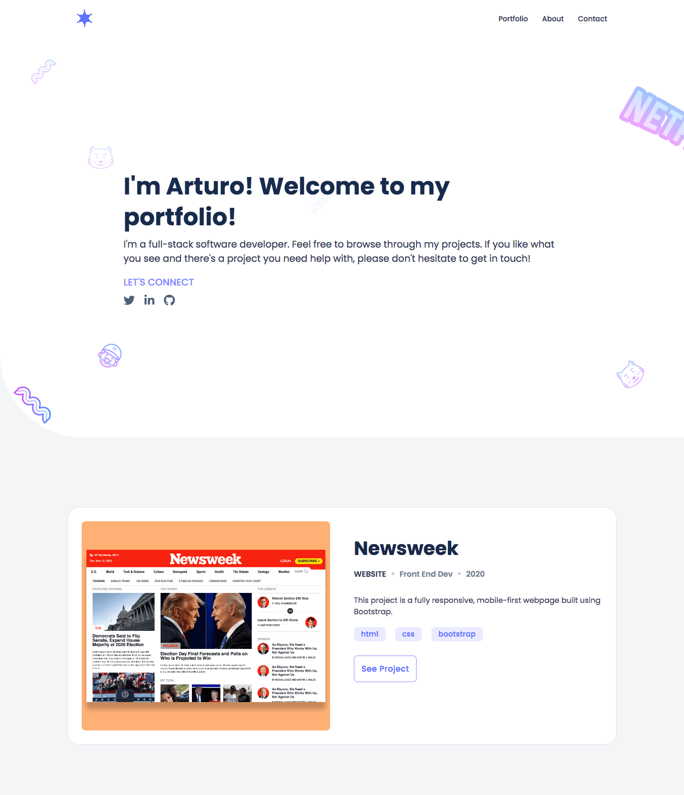
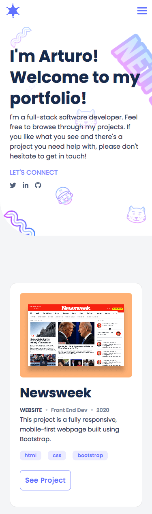
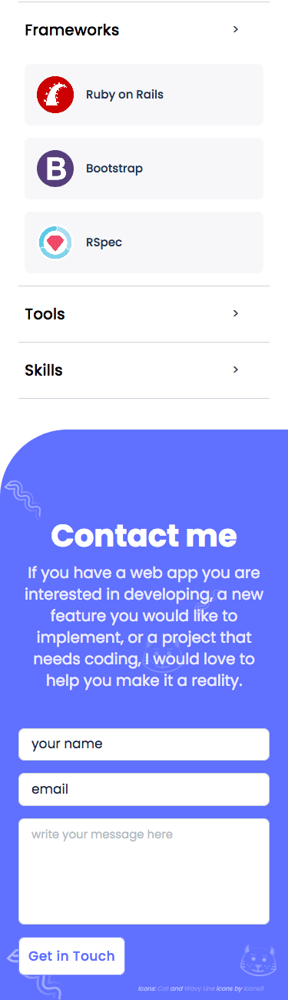
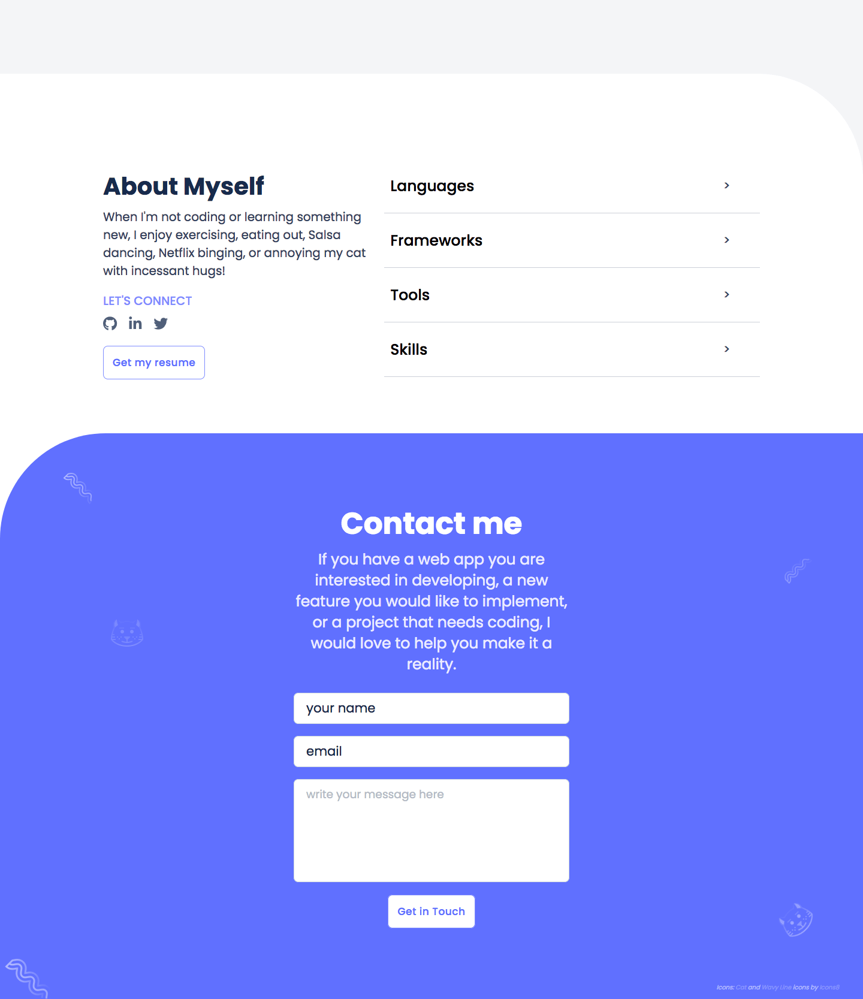

# Portfolio

> This is my portfolio project. Here you will find some of my best projects so far as a full-stack developer.

## Screenshots

### More Screenshots

  
Mobile

  

   
  

  
Desktop

  

 

The website has a mobile-first approach, following best industry practices for design, colors, fonts, and layout.
I used HTML, CSS, SCSS, Bootstrap 5, and some JS for this project. The page is fully responsive for two different screen
sizes:
- mobile: up to 767px
- desktop: from 768px

## Built With

- Major languages: HTML5, CSS3, JS
- Frameworks: Bootstrap 5, Github pages
- Technologies used: VS Code, FormSubmit, Git, Github, Hint, Stylint, Github workflows
## Live Demo

[Live Demo Link](https://starsheriff.tech)

## Getting Started

To get a local copy up and running, follow these simple steps.

### Setup and Installation

#### Clone / Download Repo
1. Open your terminal or command prompt.
2. If you do not have git installed in your system, skip this step and go to step 3; otherwise, go to the directory
where you want to copy the project files and clone it by copying this text into your command prompt/terminal:
`git@github.com:StarSheriff2/Portfolio.git`.
 Now go to the ***"Install Dependencies"*** section
3. Download the program files by clicking on the green button that says “**Code**“ on the upper right side of the
project frame.
4. You will see a dropdown menu. Click on “**Download ZIP**“.
5. Go to the directory where you downloaded the **ZIP file** and open it. Extract its contents to any directory you want
in your system.

## Usage
1. Go to your browser of choice
2. Select File > open
3. Go to the directory where you downloaded the project files
4. Select ***'index.html'*** and click/tap 'Open'
5. Do not forget to follow me on social media!

## Authors

👤 **Arturo Alvarez**

- Github: [@StarSheriff2](https://github.com/StarSheriff2)
- Twitter: [@ArturoAlvarezV](https://twitter.com/ArturoAlvarezV)
- Linkedin: [Arturo Alvarez](https://www.linkedin.com/in/arturoalvarezv/)

## 🤝 Contributing

Contributions, issues, and feature requests are welcome!

Feel free to check the [issues page](https://github.com/StarSheriff2/receipe-buddies/issues).

## Show your support

Give a ⭐️ if you like this project!

## Acknowledgments

- Icons: <a target="_blank" href="https://icons8.com/icon/57371/cat">Cat</a> icon and <a target="_blank"
  href="https://icons8.com/icon/ig_Dm8k0orQz/wavy-line">Wavy Line</a> icon by <a target="_blank"
  href="https://icons8.com">Icons8</a>

## 📝 License

This project is [MIT](https://github.com/StarSheriff2/Portfolio/blob/edit-readme/LICENSE) licensed.
